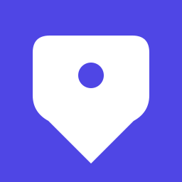

# neary — Brand Manual

The mark is a stylized **location pin** — the most direct metaphor for what neary does: locate, transit, near. Saturated indigo, bold white, green accent for live vehicles.

This document is the single source of truth for the visual identity. If something is not described here, it's not part of the brand.

---

## 1. Logo

### 1.1 Primary mark

The full-color logo on a saturated indigo background. **This is the default for every use.** No outlines, no gradients, no 3D — just flat color.



### 1.2 Variants

| File | When to use |
|---|---|
| `neary-logo.svg` | Default. iOS app icon, web favicon, GitHub avatar, anywhere. |
| `neary-logo-maskable.svg` | Android adaptive icons. Content is pulled inside the central 80% safe area so the OS mask can't crop the mark. |
| `neary-logo-mono.svg` | Single-ink black on transparent. Use for etched/laser print, single-ink merch, or any context that can't render color. |
| `neary-wordmark.svg` | Primary mark + "neary" wordmark. For product pages, README headers. |
| `n3ary-wordmark.svg` | Primary mark + "n3ary" wordmark. For org-level docs, the n3ary.com masthead. |
| `neary-wordmark-light.svg` | Same as `neary-wordmark.svg` but with **white text** — for use on **dark surfaces** (dark-mode websites, dark hero sections, slides). The mark stays saturated indigo + white pin; only the wordmark text fill changes from `#0F172A` to `#FFFFFF`. |
| `n3ary-wordmark-light.svg` | Same as `n3ary-wordmark.svg` but with white text — for dark surfaces. |

### 1.3 Construction

The mark is a single asymmetric pin shape with one inner cutout (the "stop dot" — the indigo background showing through). The pin's pointed base sits off-center to the left, giving the silhouette asymmetric character without being arbitrary.

### 1.4 Logo usage rules

**Minimum size:** 16 × 16 px (favicon). The mark stays readable at this size.

**Clear space:** Minimum 10% of logo width on all sides. Nothing else should sit inside this zone.

**Don't:**
- Stretch, distort, or rotate
- Recolor the mark or change the background
- Add effects (shadows, gradients, glow, 3D, bevels)
- Place the mark on busy backgrounds without contrast
- Use the monochrome variant on a colored background
- Use the primary mark on a colored background other than white or transparent

---

## 2. Color

### 2.1 Primary palette

| Swatch | Name | Hex | Role |
|---|---|---|---|
|  | Indigo 600 | `#4F46E5` | Logo background, primary brand color |
|  | White | `#FFFFFF` | Logo mark, text on indigo |
|  | Green 500 | `#22C55E` | Live GPS vehicle accent (the green dot) |

**Color usage:**
- **Indigo** is the brand. It carries the identity.
- **White** is the foreground — the mark on the indigo, text on indigo.
- **Green** is reserved for the "live GPS vehicle" semantic. Don't use it elsewhere.

### 2.2 Supporting palette

| Swatch | Name | Hex | Role |
|---|---|---|---|
|  | Slate 900 | `#0F172A` | Dark surfaces, body text on light |
|  | Slate 600 | `#475569` | Muted text, secondary UI |
|  | Slate 100 | `#F1F5F9` | Light surfaces, dividers |

---

## 3. Typography

The wordmark uses the **system sans-serif stack** for portability — no web-font loading, no FOIT, works offline:

```
font-family: ui-sans-serif, system-ui, -apple-system, "Segoe UI", Inter, sans-serif;
```

This renders as:
- **iOS / macOS**: SF Pro
- **Android**: Roboto
- **Windows**: Segoe UI
- **Linux**: System UI font
- **Web (with Inter loaded)**: Inter

**Weights:**
- **700 (bold)** — wordmark, H1, H2
- **600 (semibold)** — H3, subheadings
- **500 (medium)** — labels, captions
- **400 (regular)** — body text

---

## 4. Application

### 4.1 iOS App Icon

Use `neary-logo.svg` directly. iOS automatically applies its 22.37% squircle mask — **don't** add your own rounded corners.

Required exports:
- `neary-180.png` — iPhone @3x
- `neary-120.png` — iPhone @2x
- `neary-1024.png` — App Store

In `Info.plist` / Xcode, no special config needed — the icon files alone are enough.

### 4.2 Android / Chrome PWA

Use `neary-logo.svg` for the regular icon, `neary-logo-maskable.svg` for adaptive icons.

In `manifest.json`:
```json
{
  "icons": [
    { "src": "/neary-logo.svg", "sizes": "any", "type": "image/svg+xml" },
    { "src": "/neary-192.png", "sizes": "192x192", "type": "image/png" },
    { "src": "/neary-512.png", "sizes": "512x512", "type": "image/png" },
    { "src": "/neary-logo-maskable.svg", "sizes": "any", "type": "image/svg+xml", "purpose": "maskable" }
  ]
}
```

### 4.3 GitHub

| Use | Asset |
|---|---|
| Organization avatar | `neary-logo.svg` (preferred) or `neary-512.png` |
| Repository social preview | `social-preview.png` (1280 × 640) |
| README badge / inline icon | `neary-32.png` or `neary-64.png` |
| Favicon | `favicon.ico` (16 + 32 multi-resolution) |

To set the social preview: **GitHub repo → Settings → Social preview → Upload an image…**

### 4.4 Web favicon

```html
<link rel="icon" type="image/png" sizes="32x32" href="/neary-32.png">
<link rel="icon" type="image/png" sizes="16x16" href="/neary-16.png">
<link rel="apple-touch-icon" sizes="180x180" href="/neary-180.png">
```

### 4.5 Dark surfaces

The saturated indigo background works on dark surfaces (sections, cards, dark mode). The mark itself doesn't need to change.

---

## 5. Voice

When writing about or for neary:

- **Direct, not clever.** "Find your stop" beats "Discover your journey."
- **Specific, not generic.** "Live vehicle in 38 seconds" beats "Coming soon."
- **Confident, not loud.** The mark does the talking; copy is plain.

---

## 6. File inventory

### 6.1 Source SVG (vector — scale to any size)

| File | Purpose |
|---|---|
| `neary-logo.svg` | Primary mark |
| `neary-logo-maskable.svg` | Android adaptive safe-area variant |
| `neary-logo-mono.svg` | Single-ink black on transparent |
| `neary-wordmark.svg` | Mark + "neary" (dark text) |
| `n3ary-wordmark.svg` | Mark + "n3ary" (dark text) |
| `neary-wordmark-light.svg` | Mark + "neary" (white text) — for dark surfaces |
| `n3ary-wordmark-light.svg` | Mark + "n3ary" (white text) — for dark surfaces |
| `social-preview.svg` | Source for the GitHub social card |

### 6.2 PNG exports (raster — specific sizes)

| File | Size | Purpose |
|---|---|---|
| `neary-16.png` | 16 × 16 | Favicon (small) |
| `neary-32.png` | 32 × 32 | Favicon, README badge |
| `neary-64.png` | 64 × 64 | Small inline icon |
| `neary-128.png` | 128 × 128 | Medium inline icon |
| `neary-180.png` | 180 × 180 | iOS @3x |
| `neary-192.png` | 192 × 192 | Android PWA / Chrome |
| `neary-256.png` | 256 × 256 | Large |
| `neary-512.png` | 512 × 512 | Android PWA large / GitHub avatar |
| `neary-1024.png` | 1024 × 1024 | App Store |
| `social-preview.png` | 1280 × 640 | GitHub social preview |

### 6.3 Multi-resolution

| File | Purpose |
|---|---|
| `favicon.ico` | Browser tab favicon (16 + 32 multi-resolution ICO) |

---

## 7. Don't

A quick reference. If you're about to do any of these, don't.

- ❌ Rotate the mark
- ❌ Add a stroke / outline
- ❌ Use a gradient or drop shadow
- ❌ Recolor (other than the official palette)
- ❌ Use green anywhere except the live GPS vehicle accent
- ❌ Place on a background that loses contrast
- ❌ Stretch non-uniformly
- ❌ Add elements behind or around the mark
- ❌ Use the monochrome variant on color
- ❌ Use the dark-text wordmark on a dark surface — use `*-wordmark-light.svg` instead
- ❌ Use a custom typography weight outside the stack

---

## 8. Source

The SVG sources are the canonical artwork. PNGs are generated from them and should be regenerated when the SVG changes. The brand manual and any derivatives must trace back to these files.